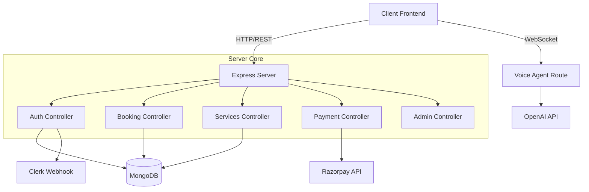

# Travel Buddy Server

The backend API for the Sustainable Travel Planner platform. This Node.js/Express server manages user authentication, bookings, service listings, payments, and connects to the AI Voice Agent.

## 🏗️ Architecture

The server follows a classic Controller-Service-Repository pattern (implemented as Controllers and Mongoose Models) with Express routes.



## 🚀 Getting Started

### Prerequisites

- Node.js (v18+)
- MongoDB (Local or Atlas)
- Clerk Account (for Auth)
- Razorpay Account (for Payments)
- OpenAI API Key (for Voice Agent)

### Installation

1. **Navigate to the server directory**

   ```bash
   cd server
   ```

2. **Install Dependencies**

   ```bash
   npm install
   ```

3. **Environment Setup**
   Create a `.env` file in the `server` root:

   ```env
   PORT=3000
   MONGODB_URI=mongodb+srv://... (Your MongoDB Connection String)

   # Authentication (Clerk)
   CLERK_PUBLISHABLE_KEY=pk_...
   CLERK_SECRET_KEY=sk_...
   CLERK_WEBHOOK_SECRET=whsec_...

   # Payments
   RAZORPAY_KEY_ID=rzp_...
   RAZORPAY_KEY_SECRET=...

   # AI Services
   OPENAI_API_KEY=sk-...

   # CORS
   FRONTEND_URL=http://localhost:5173
   ```

### Running the Server

- **Development Mode** (with hot-reload):
  ```bash
  npm run dev
  ```
- **Production Start**:
  ```bash
  npm run start
  ```

## 🛠️ Key Components & Workflow

### 1. **Authentication**

- Uses **Clerk** for user management.
- **Webhooks** (`/api/webhooks`) sync user data from Clerk to our local MongoDB `users` collection.
- **Auth Middleware** (`middleware/auth.middleware.js`) verifies requests.

### 2. **Bookings & Services**

- **Sellers** list services (Hotels, Taxis) via `sellerRoutes`.
- **Users** browse via `servicesRoutes` and book via `bookingRoutes`.
- **Admin** oversees all activity via `adminRoutes`.

### 3. **Payments**

- Integrated with **Razorpay**.
- Accessible via `/api/payment`.
- Handles order creation and verification.

### 4. **AI Voice Agent**

- Located at `/api/voice-agent`.
- Handles interaction with OpenAI Realtime API for the travel assistant.

## 📂 Project Structure

```
server/
├── src/
│   ├── index.js             # Entry point
│   ├── controllers/         # Logic for each route
│   ├── routes/              # API Route definitions
│   ├── models/              # Mongoose Database Schemas
│   ├── middleware/          # Auth & Validation middleware
│   └── lib/                 # DB Connection & Helper configs
├── .env                     # Environment variables
└── package.json             # Dependencies
```

## 👩‍💻 Developer Notes

- **Database**: When adding a new feature that needs data, create a new Model in `src/models/`.
- **Routes**: Always register new routes in `src/index.js`.
- **Security**: Never commit `.env`.
